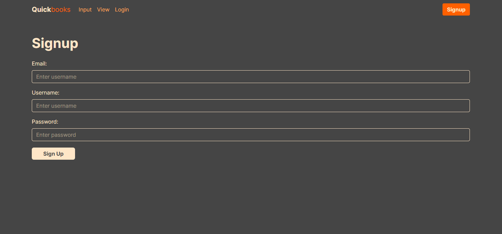
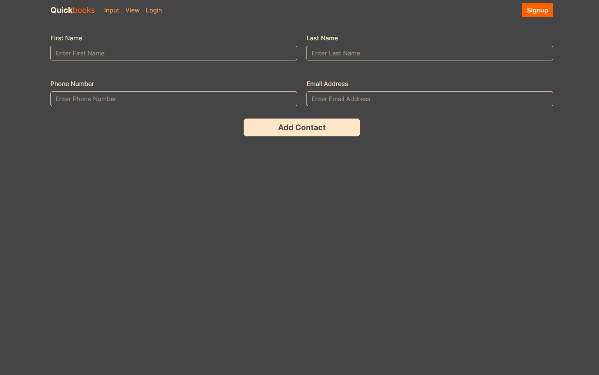
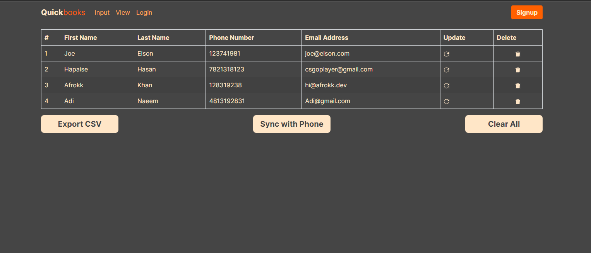

 

  

  <h3 align="center">Quickbooks</h3>

  

    Manage Contacts in a QuickBook! 
  

## About The Project

Quickbooks is a smart phonebook web-app that allows you to maintain and manage your contact list and instantly export it as a CSV, as well as sync with your Android or iOS smartphone.

## Features
* Easily add, update and manage your contact list in your browser.
* Custom validation for inputs.
* Intuitive interface.
* User Authentication.
* Sync your contacts with your mobile phone.

## Built With
### Development
* [![React][React.com]][React-url]
* [![JavaScript][JavaScript.com]][JavaScript-url]
* [![mySQL][mySQL.com]][mySQL-url]
* [![Node][Node.com]][Node-url]
* [![ExpressJS][ExpressJS.com]][ExpressJS-url]
* [![Bootstrap][Bootstrap.com]][Bootstrap-url]
along with Axios, Yup and EJS.

### Design/Prototyping
* [![Figma][Figma.com]][Figma-url]
* [![Photoshop][Photoshop.com]][Photoshop-url]

### Version Control
* [![Git][Git.com]][Git-url]
* [![GitHub][GitHub.com]][GitHub-url]

## Design
  

    
  

  

    
  

    

    
  

[React.com]: https://img.shields.io/badge/React-20232A?style=for-the-badge&logo=react&logoColor=61DAFB
[React-url]: https://reactjs.org/
[JavaScript.com]: https://img.shields.io/badge/JavaScript-323330?style=for-the-badge&logo=javascript&logoColor=F7DF1E
[JavaScript-url]: https://en.wikipedia.org/wiki/JSX_(JavaScript)
[mySQL.com]: https://img.shields.io/badge/mysql-%2300f.svg?style=for-the-badge&logo=mysql&logoColor=white
[mySQL-url]: https://www.mysql.com/
[Node.com]: https://img.shields.io/badge/node.js-6DA55F?style=for-the-badge&logo=node.js&logoColor=white
[Node-url]: https://nodejs.org/en
[ExpressJS.com]: https://img.shields.io/badge/express.js-%23404d59.svg?style=for-the-badge&logo=express&logoColor=%2361DAFB
[ExpressJS-url]: https://expressjs.com/
[Bootstrap.com]: https://img.shields.io/badge/bootstrap-%23563D7C.svg?style=for-the-badge&logo=bootstrap&logoColor=white
[Bootstrap-url]: https://getbootstrap.com/
[Figma.com]: https://img.shields.io/badge/Figma-F24E1E?style=for-the-badge&logo=figma&logoColor=white
[Figma-url]: https://www.figma.com/
[Photoshop.com]: https://img.shields.io/badge/Adobe%20Photoshop-31A8FF?style=for-the-badge&logo=Adobe%20Photoshop&logoColor=black
[Photoshop-url]: https://www.adobe.com/ca/products/photoshop.html
[Git.com]: https://img.shields.io/badge/GIT-E44C30?style=for-the-badge&logo=git&logoColor=white
[Git-url]: https://git-scm.com/
[GitHub.com]: https://img.shields.io/badge/GitHub-100000?style=for-the-badge&logo=github&logoColor=white
[GitHub-url]: https://github.com/
